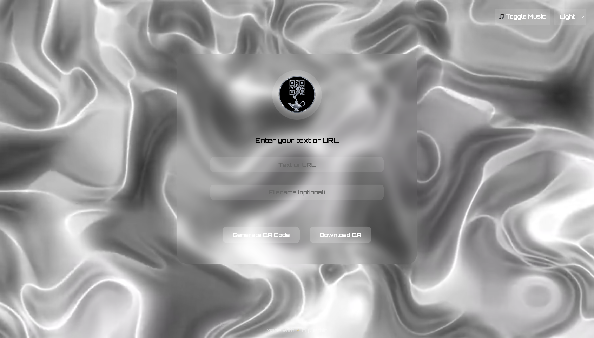

Here's a clean and professional `README.md` file for your QR Code Generator project, based on your UI and features:

---

````markdown
# 🔳 QR Code Generator

A stylish, futuristic QR Code generator that allows users to instantly create and download QR codes from any text or URL input. Features include dynamic dark/light mode switching, ambient background video, and even background music toggle for an immersive experience.




---

## 🚀 Features

- 🎯 Generate QR codes from text or URL
- 💾 Download QR code as PNG (optional filename support)
- 🌙 Toggle between Dark and Light modes
- 🔊 Background music toggle for a unique user experience
- 🎥 Beautiful animated video background (dark/light variants)
- 💻 Responsive design with modern UI using Orbitron font and glassmorphism
- 🎨 Smooth transitions and animations

---

## 📸 Preview

| Dark Mode | Light Mode |
|----------|-----------|
|  |  |

---

## 🛠️ Tech Stack

- HTML
- CSS (Glassmorphism, Transitions)
- JavaScript (DOM Manipulation, QR Code Generation)
- QR Code Library: [qrcode.js](https://github.com/davidshimjs/qrcodejs)
- Font: [Orbitron](https://fonts.google.com/specimen/Orbitron)

---

## 📦 How to Use

1. Clone this repo:
   ```bash
   git clone https://github.com/your-username/qr-code-generator.git
   cd qr-code-generator
````

2. Open `index.html` in your browser.

3. Enter text or URL, click **Generate QR Code**, and download if needed.

---

## 🧠 Author

Made with ⚡ by **Jathin**

---

## 📜 License

This project is open source and available under the [MIT License](LICENSE).

---

## 💡 Ideas for Future Improvements

* Scan QR code using webcam
* Save QR history locally
* Add more themes (neon, retro, etc.)
* PWA support for offline access

```

---

Let me know if you want me to:
- Add a license file (`MIT`).
- Help you prepare the screenshots folder.
- Deploy this on GitHub Pages with a live demo.

Would you like a `LICENSE` file too?
```
